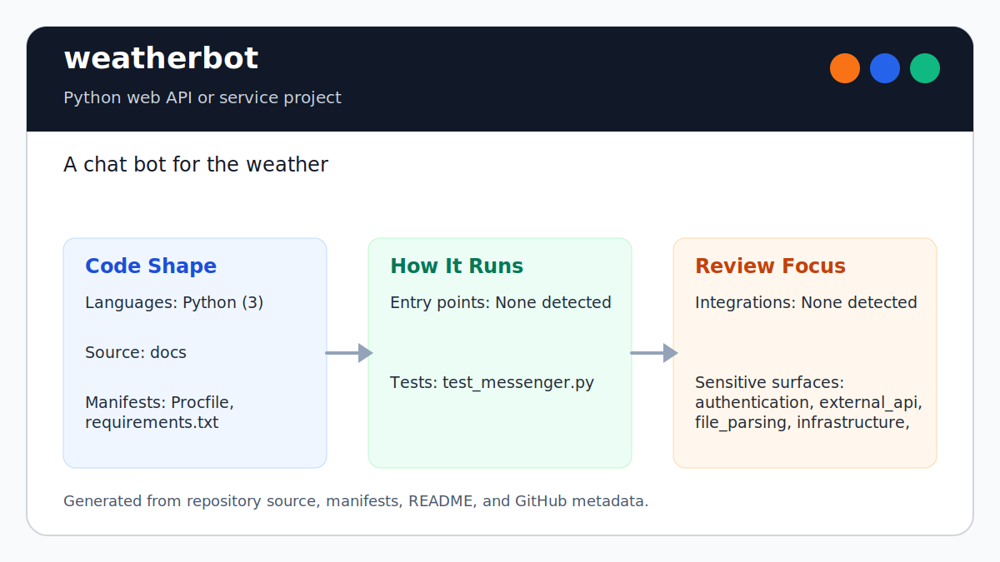

# weatherbot

<!-- README-OVERVIEW-IMAGE -->


## Overview

`garethpaul/weatherbot` is a Python web API or service project. A chat bot for the weather

This README is based on the checked-in source, manifests, scripts, and repository metadata on the `master` branch. The project language mix found during review was: Python (3).

## Repository Contents

- `README.md` - project overview and local usage notes
- `requirements.txt` - Python dependency or packaging metadata
- `Procfile`
- `SECURITY.md` - security reporting and disclosure guidance
- `VISION.md` - project direction and maintenance guardrails

Additional scan context:

- Source directories: no top-level source directories detected
- Dependency and build manifests: Procfile, requirements.txt
- Entry points or build surfaces: none detected
- Test-looking files: test_messenger.py

## Getting Started

### Prerequisites

- Git
- Python matching the era of the project

### Setup

```bash
git clone https://github.com/garethpaul/weatherbot.git
cd weatherbot
python -m pip install -r requirements.txt
```

The setup commands above are derived from repository files. Legacy mobile, Python, or JavaScript samples may require older SDKs or package versions than a modern workstation uses by default.

## Running or Using the Project

- Run `python messenger.py $PORT` after installing dependencies and setting the required tokens.

## Testing and Verification

- `make verify` runs syntax checks and dependency-free webhook, Wit action,
  Messenger text normalization, OpenWeather shape, request timeout, and
  outbound API and Wit log-privacy contract checks.
- `make check` runs `make verify` with bytecode cleanup before and after.
- `python3 scripts/check_weatherbot_contracts.py` runs just the webhook and outbound API contracts.
- Completed maintenance plans live under `docs/plans` and are checked by
  `make check`.
- `python -m unittest test_messenger` runs the legacy test suite when Python 2 dependencies are installed.

When the required SDK or runtime is unavailable, use static checks and source review first, then verify on a machine that has the matching platform toolchain.

## Configuration and Secrets

- `WIT_TOKEN` configures Wit.ai access.
- `FB_PAGE_TOKEN` configures Facebook Messenger replies.
- `FB_VERIFY_TOKEN` configures Messenger webhook verification.
- `OPEN_WEATHER_TOKEN` configures OpenWeather lookup.
- `REQUEST_TIMEOUT` optionally overrides outbound request timeout seconds;
  invalid, non-finite, or non-positive values fall back to `5.0`.
- `WEATHERBOT_DEBUG=1` enables Bottle debug mode for local development; it is
  disabled by default.

## Security and Privacy Notes

- Review changes touching authentication or token handling; examples from the scan include messenger.py, wit.py.
- Review changes touching external API calls or credential-adjacent configuration; examples from the scan include messenger.py, wit.py.
- Review changes touching network requests, sockets, or service endpoints; examples from the scan include messenger.py, wit.py.
- Review changes touching file, media, JSON, XML, CSV, OCR, or data parsing; examples from the scan include messenger.py, test_messenger.py, wit.py.
- Review changes touching infrastructure, proxy, cloud, or deployment configuration; examples from the scan include messenger.py.

## Maintenance Notes

- See `SECURITY.md` for vulnerability reporting and safe research guidance.
- See `VISION.md` for project direction and contribution guardrails.
- See `docs/plans/2026-06-08-weatherbot-webhook-api-hardening.md` for the
  current webhook and API client hardening baseline.
- See `docs/plans/2026-06-08-weatherbot-verify-token-fails-closed.md` for the
  Messenger verify-token fail-closed contract.
- See `docs/plans/2026-06-08-weatherbot-wit-entity-shape.md` for malformed Wit
  entity handling in forecast actions.
- See `docs/plans/2026-06-09-weatherbot-weather-result-shape.md` for malformed
  OpenWeather result handling.
- See `docs/plans/2026-06-09-weatherbot-request-timeout.md` for bounded
  request timeout environment parsing.
- See `docs/plans/2026-06-09-weatherbot-debug-mode.md` for the opt-in Bottle
  debug-mode guard.
- See `docs/plans/2026-06-09-weatherbot-messenger-text-normalization.md` for
  blank Messenger text rejection and trim behavior before Wit calls.
- See `docs/plans/2026-06-09-weatherbot-wit-log-privacy.md` for Wit request
  and response debug log privacy coverage.

## Contributing

Keep changes small and tied to the project that is already present in this repository. For code changes, document the toolchain used, avoid committing generated dependency directories or local configuration, and update this README when setup or verification steps change.
